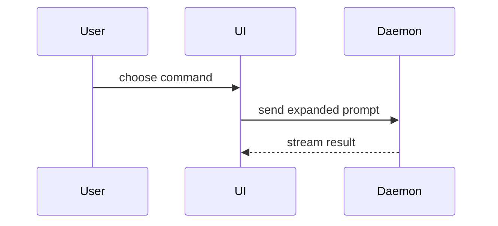

Help the user understand the current topic of conversation visually. Skip the preamble and keep prose brief. Pick the smallest view that makes the key point clear.

## Output directly in Pi

Default to diagrams in the chat response, readable in Pi without a browser or extension. Use compact boxes, trees, and ASCII arrows in `text` fences. Keep diagrams narrow, and split dense diagrams into smaller views. When running as a subagent, return the diagram in the response so the parent can include it in chat.

```text
[User request]
      |
      v
[Agent loads show-me]
      |
      v
[Diagram in Pi chat]
```

## Choose a readable format

- Use short Markdown headings, **bold labels**, and `inline code` for explanations. Keep prose outside code fences.
- Use a language-tagged fence when the content fits that language. Use `yaml` for role or state mappings, `python` for Python-like pseudocode, and `tsx` for component sketches. Syntax colours depend on the user's renderer and theme.
- Reserve `text` fences for spatial layouts that need fixed-width alignment, such as file trees. Prefer one compact diagram over several grey text blocks.
- Use `diff` for actual before/after changes, not to colour unrelated facts green or red.
- Distinguish roles and states with text labels. If the user explicitly requests a colour view, use the HTML view described below and keep a short summary in chat.
- Use ASCII arrows `->` and `<-` in text diagrams.

For example, show roles as a structured mapping rather than aligned prose:

```yaml
sponsorship:
  owner: Alice
  recipient: Bob
  reserve_sponsor: unsupported
```

**Constraint:** A generic field definition does not prove that this object type supports it.

## Pick the visual

- Show logic or an algorithm as Python-like pseudocode. Label sketches as illustrative when they are not executable:

```python
def on_save(content):
    if content == cached_content:
        return cached_result
    write(content)
    return fresh_result
```

- Show runtime control flow as a call tree:

```text
submitForm
  createSession
    persistPrompt
    launchAgent
  navigateToSession
```

- Show UI structure as a component tree, including state and module boundaries that matter:

```tsx
<SessionPage> (apps/example/src/routes/session.tsx)
  useSessionEvents()
  <SessionToolbar>
    <RunSkillButton> (packages/ui)
```

- Show file responsibility or a broad refactor as a shallow file tree:

```text
src/
├── commands/       # parses user actions
├── sessions/       # owns session state
└── transport/      # sends API requests
```

- Show component interaction, control flow, or data flow with text diagrams in Pi. Use Mermaid only when the user requests its source or the output surface is known to render it:



- Use `diff` when the point is what changes and the surrounding shape already exists. Match the diff shape to the topic.

For a component change:

```diff
 <SessionPage>
   useSessionEvents()
   <SessionToolbar>
+    <RunSkillButton />
   <SessionTimeline>
+    <SkillResultCard />
```

For a file-layout change:

```diff
 src/
 ├── commands/
+│   └── show-me.ts       # expands the slash command
 ├── sessions/
-└── transport.ts
+└── transport/
+    ├── client.ts
+    └── stream.ts
```

For a call-tree or call-stack change:

```diff
 submitForm
   createSession
     persistPrompt
+    expandSkillMention
     launchAgent
-  navigateToSession
+  navigateToSession
+    subscribeToEvents
```

For a state or control-flow change:

```diff
 on(save)
-  write content
+  if content is unchanged
+    return cached result
+  write new content
+  invalidate cache
```

- Show the whole block when most of it is new, when omitted context would hide ownership or order, or when the user needs a copyable target shape:

```ts
function expandSkill(command: string): string {
  const skillName = command.slice(1)
  return `use the ${skillName} skill`
}
```

- Only when the user explicitly requests HTML, a browser view, or a colour view, write one focused HTML file. Use a diagram, an infographic, or a short slide deck, whichever fits the point. Match the product's colours, type, spacing, and components. If there is no product style, use a high-contrast dark background with a small, consistent set of accent colours. Use real labels and data, distinguish unknown from unsupported, and support desktop and mobile. Then open it for the user:

```bash
open "path/to/show-me-{description}.html"
```

If `open` prints a URL, include it in your reply so the user can Ctrl-click it in Herdr.

### guidance

Place each visual next to the short text it supports. Keep only the calls, files, props, states, and boundaries needed to answer the user's current question or the options to resolve the current discussion point.

You may use one of these, you may use several, it is unlikely you will use all of them. Use your judgement and don't overwhelm the user.
